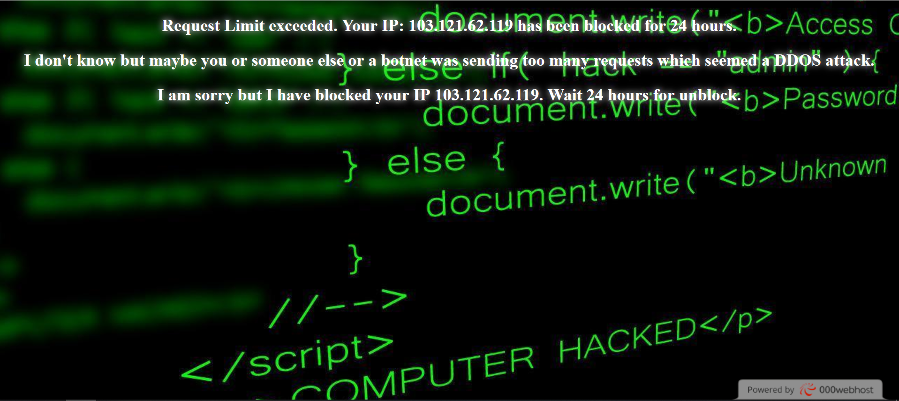

# Rate_Limit_DDOS_WAF_IP_Block_24
# A PHP firewall to detect incoming HTTP GET and POST requests to filter out DDOS attacks using the request limit of 1000 requests per hour. Then it blocks the IP for 24 hours.
# Maintains two log files, one for request counting and the other is for blacklisting an IP. Each file is reset after 24 hours.
# You can increase the time by editing the code.
# Also you can manually remove any ip from blacklist by simply removing them from log files.
# To install this firewall, extract the zip file in the directory where your config.php is in.
# Then write this line in the beginning of your config.php and save it. The line is: <php? require_once "rate_limit_24.php"; ?> 
# Installation completed.
# To get the zip password, email me at: jarircse16@gmail.com with a subject . Note that payment is required, this is not free. 

